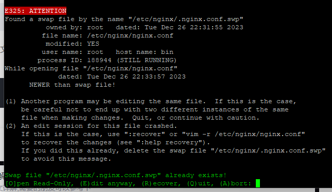

# vim 编辑时由于异常退出正在编辑的文件，再次编辑该文件时出现提示



解决：[nginx 配置踩坑 Found a swap file by the name “.nginx.conf.swp“](https://blog.csdn.net/Lostcoders/article/details/125744646)

在 nginx 目录下输入 ls -a 会发现一个.nginx.conf.swp 文件
执行 rm -rf .nginx.conf.swp 命令删除该文件即可

```bash
    ls -a

    rm -rf .nginx.conf.swp
```
