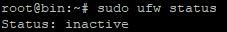

# 命令

- [命令](#命令)
  - [yum](#yum)
  - [vim](#vim)
  - [环境变量](#环境变量)
  - [gedit 命令 – GNOME 桌面的文本编辑器](#gedit-命令--gnome-桌面的文本编辑器)
  - [Nano](#nano)
  - [防火墙](#防火墙)
  - [mkdir](#mkdir)

1. 重启

```

reboot（非必要时不用）
```

```

shutdown -r now（立刻安全重启(root 用户使用)）
```

2. 关机

```
shutdown -h now
```

3. df -h

df -h 是用于查看文件系统空间使用情况的命令。其中，df 代表"disk free"，即磁盘剩余空间，-h 代表使用人类可读的格式来显示空间大小，以 KB、MB 或 GB 为单位。命令执行后，会显示每个挂载点的文件系统名称、总共的磁盘空间、已用空间、可用空间和空间使用率。


### yum

yum 是什么？

yum 是 Yum 的简写，意为“Yellowdog Updater Modified”（Yellowdog 是 yum 的开发者，Updater 是 yum 的更新程序，Modified 是 yum 的修改版本）。yum 是 Red Hat Linux 和它的衍生产品中一个很重要的包管理器。

### vim

**vim 中保存退出命令**

| 命令          | 简单说明                                                                                                                                                                                             |
| ------------- | ---------------------------------------------------------------------------------------------------------------------------------------------------------------------------------------------------- |
| :w            | 保存编辑后的文件内容，但不退出 vim 编辑器。这个命令的作用是把内存缓冲区中的数据写到启动 vim 时指定的文件中。                                                                                         |
| :w!           | 强制写文件，即强制覆盖原有文件。如果原有文件的访问权限不允许写入文件，例如，原有的文件为只读文件，则可使用这个命令强制写入。但是，这种命令用法仅当用户是文件的属主时才适用，而超级用户则不受此限制。 |
| :wq           | 保存文件内容后退出 vim 编辑器。这个命令的作用是把内存缓冲区中的数据写到启动 vim 时指定的文件中，然后退出 vim 编辑器。另外一种替代的方法是用 ZZ 命令。                                                |
| :wq!          | 强制保存文件内容后退出 vim 编辑器。这个命令的作用是把内存缓冲区中的数据强制写到启动 vim 时指定的文件中，然后退出 vim 编辑器。                                                                        |
| ZZ            | 使用 ZZ 命令时，如果文件已经做过编辑处理，则把内存缓冲区中的数据写到启动 vim 时指定的文件中，然后退出 vim 编辑器。否则只是退出 vim 而已。注意，ZZ 命令前面无需加冒号“：”，也无需按 Enter 键。        |
| :q            | 在未做任何编辑处理而准备退出 vim 时，可以使用此命令。如果已做过编辑处理，则 vim 不允许用户使用“:q”命令退出，同时还会输出下列警告信息：No write since last change (:quit! overrides)                  |
| :q!           | 强制退出 vim 编辑器，放弃编辑处理的结果。如果确实不需要保存修改后的文件内容，可输入“:q!”命令，强行退出 vim 编辑器。                                                                                  |
| :w filename   | 把编辑处理后的结果写到指定的文件中保存                                                                                                                                                               |
| :w! filename  | 把编辑处理后的结果强制保存到指定的文件中，如果文件已经存在，则覆盖现有的文件。                                                                                                                       |
| :wq! filename | 把编辑处理后的结果强制保存到指定的文件中，如果文件已经存在，则覆盖现有文件，并退出 vim 编辑器。                                                                                                      |

在使用 Vim 编辑器时，有几种方法可以保存并退出文件：

1. 使用快捷键保存并退出：按住 Shift 键，并同时按下冒号键(:)，在底部命令行上会出现一个冒号(:)光标，这是在进入 Vim 命令模式的标志。然后输入 wq，并按下 Enter 键。这样就会保存文件并退出 Vim。

2. 使用单独的命令保存并退出：同样地，在底部命令行输入冒号(:)，然后输入写入并退出命令：wq，然后按下 Enter 键。这个命令会将文本保存并退出 Vim 编辑器。

3. 使用自动命令保存并退出：可以在 Vim 的配置文件中设置自动保存并退出的命令。打开配置文件(如 ~/.vimrc)，并添加以下命令：

autocmd VimLeave \* wq

这个命令会在退出 Vim 时自动执行保存并退出操作。

除了上述这些方法，还有其他一些快捷键和命令可以用来保存和退出 Vim 编辑器：

- 使用快捷键保存文件：按下 Shift + zz。这个快捷键会将文件保存并退出 Vim。

- 仅保存文件：按下冒号(:)，然后输入命令 w，按下 Enter 键。这个命令只会保存文件，而不会退出 Vim。

- 不保存文件并退出：按下冒号(:)，然后输入命令 q，按下 Enter 键。这个命令会直接退出 Vim，不保存任何修改。

### 环境变量

一、查看环境变量

1. 使用 printenv 命令

printenv 命令可以列出所有的环境变量。只需要在终端输入 printenv 即可。


1. 使用 echo 命令

使用 echo $变量名可以查看某个指定的环境变量。例如，echo $PATH 可以查看 PATH 环境变量的值。


3. 使用 set 命令

set 命令可以显示当前 shell 进程中的所有变量，包括环境变量和用户定义的变量。


二、检查环境变量配置是否成功

1. 使用 echo 命令

可以使用 echo $变量名命令来检查环境变量配置是否成功。如果输出了环境变量的值，则说明配置成功。

例如，如果我们设置了 JAVA_HOME 环境变量，可以输入 echo $JAVA_HOME 来检查。

2. 使用 source 命令

source 命令可以重新加载环境变量配置文件。如果环境变量配置文件中有错误，使用 source 命令可以立即发现。

例如，如果我们修改了/etc/profile 文件并保存后，可以使用 source /etc/profile 命令来重新加载。

3. 使用 env 命令

env 命令可以显示当前进程的环境变量。通过比较 env 命令的输出结果和预期结果，可以判断环境变量配置是否成功。

例如，如果我们设置了 JAVA_HOME 环境变量，可以输入 env | grep JAVA_HOME 来检查。

### gedit 命令 – GNOME 桌面的文本编辑器

gedit 命令来自英文词组“GNOME text editor”的缩写，其功能是用于编辑文本信息，是 GNOME 桌面环境的文本编辑器。gedit 命令拥有非常强大的通用文本编辑功能，能够创建和编辑各类型文本文件，用户还可以向 gedit 中添加自主选择的插件，让编辑器支持更多高级功能。

语法格式：gedit [参数] [文件名]

常用参数：

- -f 忽略部分错误信息
- -R 递归处理所有子文件
- -s 使用独立模式
- -v 显示执行过程详细信息
- -w 使用独占方式打开文件
- --encoding 设置字符编码
- --help 显示帮助信息
- --list-encodings 显示可使用的编码列表
- --ne
- w-document 新建一个新文档
- --new-window 新建一个新窗口
- --preserve-root 禁止对目录进行递归操作
- --version 显示版本信息

### Nano

Linux Nano 是一款简单易用的文本编辑器

```bash
nano 文件名
```

打开一个新的终端，显示指定文件的内容。文件不存在的话，Nano 将创建一个新文件

在 Nano 编辑器中，使用键盘来执行各种操作

一些常用的命令：

- 箭头 移动光标。

- Backspace 删除字符

- Ctrl + O 保存

- Ctrl + X 退出

### 防火墙

1. 查看防火墙的状态

```bash
sudo ufw status
```



Status: inactive 不活跃

2. 开启防火墙

```bash
sudo ufw enable
```

3. 如果开启了防火墙先查看 SSH 的 22 端口有没有开放，如果没有开放，第一时间开放 22 端口（如果为了安全也可以指定 ip 开放 22 端口）

```bash
 sudo ufw allow 22
```

4. 查看 22 端口的监听状态

```bash
sudo netstat -tunlp | grep 22
```

22 端口属于监听状态，在 Windows 下能够 telnet 通

```bash

telnet 服务器ip
```

5. 关闭防火墙

```bash

sudo ufw disable
```

sudo ufw default deny //拒接所有外来访问，本机能正常访问外部访问
sudo ufw default allow //允许所有外来访问，本机不能访问外部访问
sudo ufw allow ssh //允许 ssh 访问
sudo ufw allow http //允许 http 访问
sudo ufw allow https //允许 https 访问
sudo ufw allow 80 //允许 80 端口访问
sudo ufw allow 443 //允许 443 端口访问

sudo ufw delete allow 22 //删除 21 端口的访问权限

sudo ufw allow 8001/tcp //指定开放 8001 的 tcp 协议

sudo ufw delete allow 8001/tcp //关闭指定协议端口

防火墙生效后，需要重启防火墙才能生效

```bash
sudo service ufw restart
```

### mkdir

https://www.linuxprobe.com/lxtcjwjjdjbf.html
