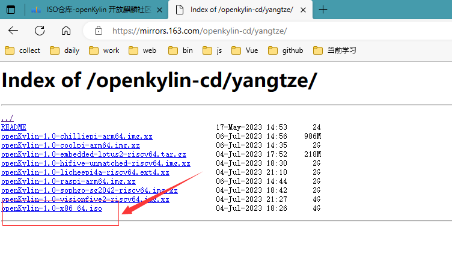

# 虚拟机安装 openKylin

- openKylin（开放麒麟）官网：https://www.openkylin.top/index-cn.html

- 仓库：https://gitee.com/openkylin

- 下载地址：https://www.openkylin.top/downloads/

- 镜像下载地址：https://www.openkylin.top/downloads/mirrors-cn.html

我选的镜像下载地址：https://mirrors.163.com/openkylin-cd/yangtze/

版本：openKylin-1.0-x86_64.iso

下载好后，根据此文章的步骤安装：https://www.somode.com/jiaocheng/45804.html

安装完成界面

> 虚拟机安装参考：开放麒麟系统安装教程（虚拟机）：https://www.somode.com/jiaocheng/45804.html
